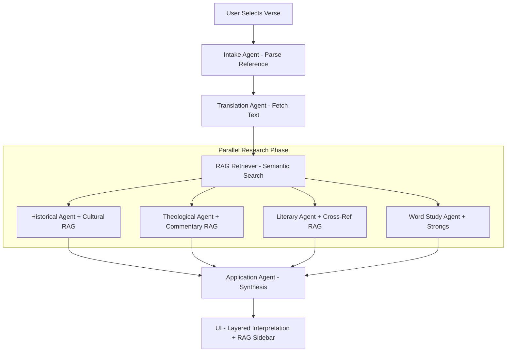

# Lumina Bible Interpreter — Build Walkthrough (v2.1 RAG Edition)

## What Was Built

A sophisticated, **agentic multi-agent Bible study system** grounded in a local vector knowledge base. Lumina provides seminary-grade analysis of any passage by orchestrating eight specialized AI agents, all running locally on your hardware.

---

## Architecture (Local + RAG)

```
Agentic bible interpretator/
├── main.py                  ← FastAPI server (auto-indexes KB on startup)
├── requirements.txt         ← Includes chromadb, fastapi, ollama-ready
├── .env                     ← OLLAMA_BASE_URL, OLLAMA_MODEL
├── rag/                     ← RAG Engine
│   ├── knowledge_base.py    ← ChromaDB manager (indexing/storage)
│   ├── retriever.py         ← Semantic search for culture/commentary
│   └── indexer.py           ← Standalone KB builder
├── agents/
│   ├── base_agent.py        ← Unified Ollama caller (strips think-blocks)
│   ├── intake_agent.py      ← Parses natural language into Bible references
│   ├── orchestrator_agent.py← Fetches RAG context & parallelizes research
│   └── (research_agents)... ← Specialized historical, theological, etc.
├── bible_data/
│   ├── jewish_culture.json  ← Second Temple, Pharisaic, & Purity data
│   ├── greek_culture.json   ← Stoic, Epicurean, & Hellenistic data
│   ├── key_verses.json      ← Seed verses for cross-referencing
│   └── commentary_notes.json← Multi-tradition theological snippets
└── static/
    ├── index.html           ← SPA with RAG context accordion & status
    ├── style.css            ← Premium dark navy/gold glassmorphism
    └── app.js               ← Orchestrates frontend state & RAG rendering
```

---

## Agentic RAG Workflow



---

## Key Features

| Feature | Description | Status |
|---------|-------------|--------|
| **Local AI Engine** | Powered by Ollama (Qwen3:8b). Zero internet needed for AI. | ✅ |
| **Vector Grounding** | Every answer is grounded in the local ChromaDB database. | ✅ |
| **Cultural Knowledge** | Access to 30+ deep-dive Jewish & Greek cultural data points. | ✅ |
| **Theological Pluralism** | Comparative views (Reformed, Catholic, Orthodox, etc.). | ✅ |
| **Canonical Links** | Automatically retrieves and links semantically related verses. | ✅ |
| **RAG Health Monitor** | UI badge shows if the Knowledge Base is ready or indexing. | ✅ |
| **Premium UI** | 7-layer study panel with interactive comparison tools. | ✅ |

---

## Setup & Running Locally

### 1. Requirements
- **Ollama**: Ensure Ollama is installed and the model is pulled:
  ```powershell
  ollama pull qwen3:8b
  ollama serve
  ```
- **Dependencies**:
  ```powershell
  pip install -r requirements.txt
  ```

### 2. Start the Engine
```powershell
python main.py
```
*Note: On the first run, the system will automatically download the embedding model (~23MB) and index the knowledge base files in `bible_data/`.*

### 3. Usage
- Select any verse in the left panel.
- Press **Interpret [Reference]**.
- Expand the **Related Context & Scriptures** section to see the source data retrieved from the vector database.

---

## Future Roadmap
- **Full Bible Indexing**: Expand RAG to cover all 31,102 KJV verses for deep semantic cross-referencing.
- **Multimodal Support**: Integrate archaeological maps and manuscript images via Vision LLMs.
- **Study Journals**: Persist multi-session study notes linked to specific RAG hits.

---
*Lumina: Illuminating the Word through Agentic Intelligence.*
